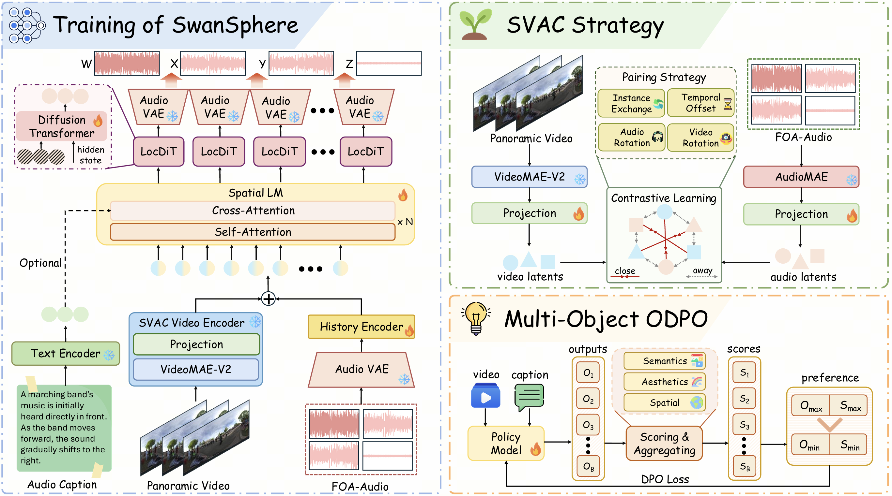

# Towards Streaming Synchronized Spatial Audio Generation via Autoregressive Diffusion Transformer

<p align="center">
  <a href="https://swansphere.github.io/"></a>
</p>



Real-time and accurate spatial audio generation is pivotal for delivering an immersive experience. However, existing spatial audio synthesis tech nologies are often encumbered by a tradeoff be tween generation quality and high inference la tency, as well as difficulty in capturing precise spa tial information from multimodal inputs. To ad dress these challenges, we propose SwanSphere, a unified streaming framework for high-fidelity spatial audio generation from panoramic videos and text prompts. SwanSphere mainly makes the following contributions: 1) We introduce a causal autoregressive diffusion transformer archi tecture that enables streaming high-quality spa tial audio generation. 2) We design a Spatial Video–Audio Contrastive (SVAC) learning strat egy to align the video encoder with the acous tic domain, and further employ a multi-objective online direct preference optimization (ODPO) scheme, resulting in strong spatial perception and robust multimodal spatial audio synthesis. 3) To alleviate the current scarcity of spatial au dio datasets, we also develop an automated an notation pipeline for generating detailed spatial captions. Experimental results demonstrate that SwanSphere achieves superior performance in both video-to-spatial and text-to-spatial audio gen eration tasks.

Project page: [swansphere.github.io](https://swansphere.github.io/)

## Installation

---

```
conda create -n swansphere python=3.10
conda activate swansphere
bash install.sh
```

## Todo

- [x] Initial code release for SwanSphere.
- [x] Project homepage is live at [swansphere.github.io](https://swansphere.github.io).
- [ ] Release model checkpoints.
- [ ] Training and evaluation datasets.

## Citation

---

If you find this work useful, please cite:

